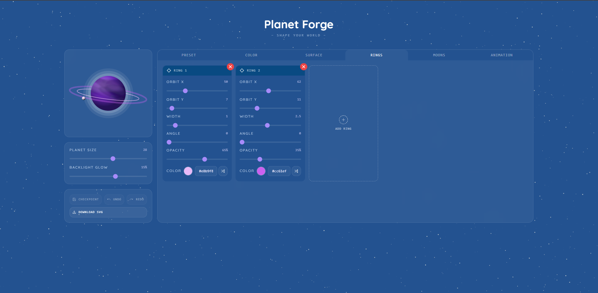

# 🪐 planet-gen

A procedural planet generator built with React, TypeScript, and Vite. Generate unique, randomised planets right in your
browser, or carefully forge one exactly to your liking via various sliders and setters :).

**[Live Demo →](https://dxzfvzs.github.io/planet-gen/)**

<p align="center">
  
</p>

<p align="center">
  
  <br />
  <sub>This isn't a rendered gif — it's the actual SVG produced by the app's <b>Download SVG</b> button.</sub>
</p>

---

## Features

Procedurally generated planets with randomised appearances
- Unique colour palettes, terrain, and visual styles per generation
- Full presets to get inspired by 
- Fully client-side generation — no backend required
- Responsive design

## Tech Stack

- [React](https://react.dev/)
- [TypeScript](https://www.typescriptlang.org/)
- [Vite](https://vitejs.dev/)  
- [Tailwind CSS](https://tailwindcss.com/)

## Getting Started

### Prerequisites

- Node.js (v18 or higher recommended)
- npm

### Installation

```bash
# Clone the repository
git clone https://github.com/dxzfvzs/planet-gen.git
cd planet-gen

# Install dependencies
npm install
```

### Development

```bash
npm run dev
```

Then open [http://localhost:5173/planet-gen/](http://localhost:5173/planet-gen/) in your browser.

### Build

```bash
npm run build
```

The output will be in the `dist/` folder.

### Preview Production Build

```bash
npm run preview
```

## How to Use

Open the [live demo](https://dxzfvzs.github.io/planet-gen/) and you'll land in the builder, split into a preview panel on
the left and a tabbed editor on the right:

- **Preset** — start from a ready-made planet, or hit randomise for a fresh generation in one click.
- **Color** — pick a highlight/mid/shadow gradient from a palette, or switch to custom mode and set your own three colours.
- **Surface** — tune the two procedural noise layers (`band` and `soft`) that make up the terrain: seed, density, opacity,
  and angle.
- **Rings** — add up to as many rings as you like, each with its own orbit, width, angle, opacity, and colour (shown in the
  screenshot above).
- **Moons** — add orbiting moons with their own size, orbit, and surface detail.
- **Animation** — choose between jiggle, rotate, or static, and tweak the mode's parameters.

The left panel also has:
- **Planet Size** / **Backlight Glow** sliders that apply globally.
- **Checkpoint / Undo / Redo** to save a snapshot of your progress and step back and forth through your edit history.
- **Download SVG** to export your planet as a standalone SVG file — exactly like the one embedded above.

Every change updates the preview live, and generation is fully deterministic per seed, so you can always get back to a
planet you liked by noting its seed and settings.

## Deployment

This project is deployed to GitHub Pages.